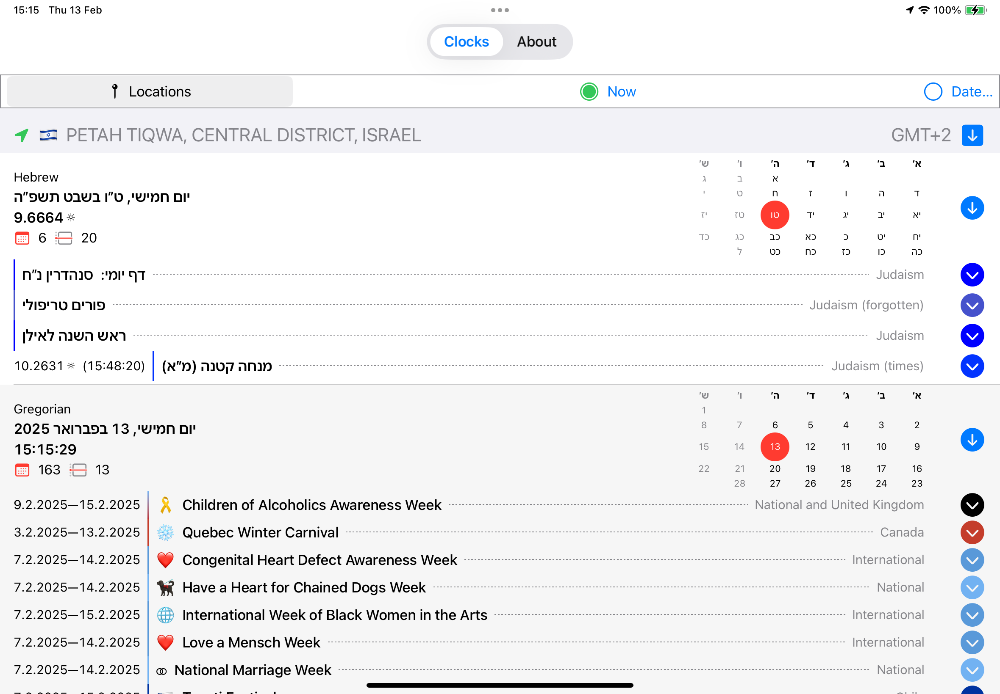
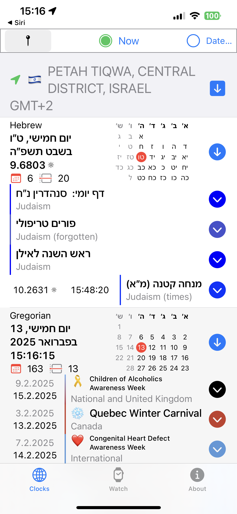

# Date-O-Rama

This is an in-progress date/time program for macOS, iOS, iPadOS, and watchOS which does things which Apple’s software does not do.  

* Localized dates and times in every supported language
* Multiple locations, including Mars
* Hebrew and Muslim calendars corrected so the day starts at Sunset, including Solar time
* In progress:  South Asian calendars (e.g., Vikram Samvat, Bangla) corrected so the day starts at Sunrise, also including Solar time
* Julian and French Republican calendars
* Multiple variants on Julian dates
* Over 5,000 observances (national, international, religious, cultural, and astronomical) built-in, many scheduled on calendars other than the Gregorian or in terms of natural events
* Intelligent event collation

This program has been a convenient excuse to experiment with technologies in Apple’s frameworks and (more recently) vibe coding.

NOTE:  As of this writing, the UI of Date-O-Rama is being revised (along with various other parts of the program).  If you compile the program, expect it to look different from the images below.

